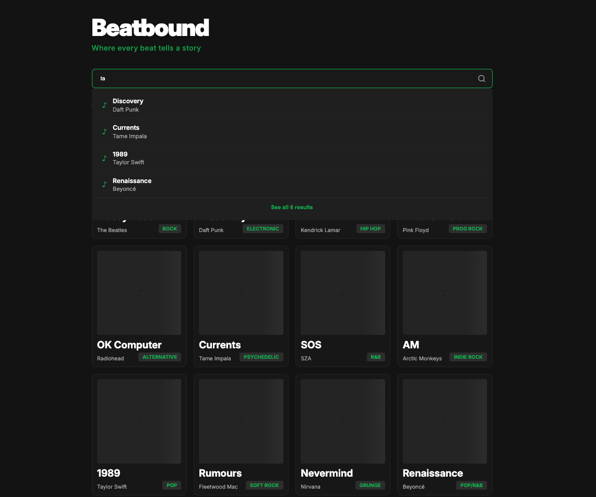
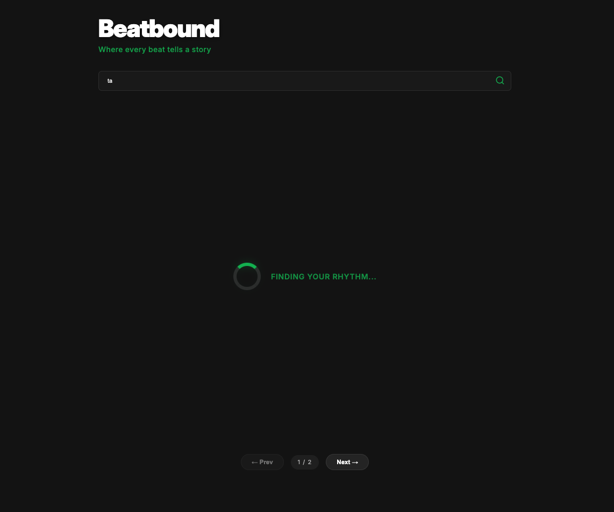
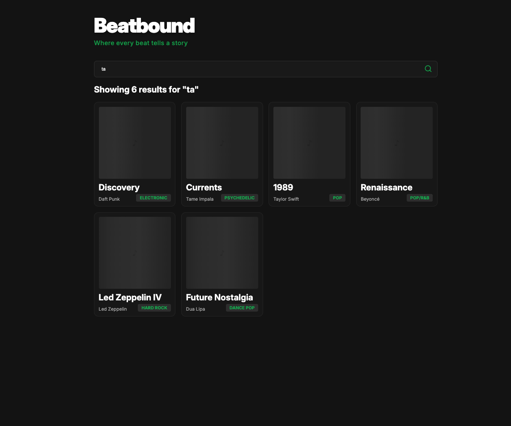

# Beatbound

Beatbound is a high-performance music discovery dashboard built with **React** and **Redux**. It features a "search-as-you-type" experience optimized for speed and scalability, ensuring a smooth UI even when handling large datasets.

## Features

- **Dual-Tier Search:**
  - **Live Preview:** A debounced dropdown shows the top 4 matches instantly as you type.
  - **Global Results:** Pressing "Enter" or clicking "See all" updates the main grid with full results.
- **Performance Optimized:** Uses `React.memo` and decoupled state logic to ensure the results grid doesn't re-render during typing.
- **Advanced Filtering:** Search across albums, artists, genres, and even individual song titles.
- **Pagination:** Easily navigate through large collections of music data.

## 🛠️ Technical Highlights

### Performance & Scalability

To prevent UI lag and "race conditions" during rapid typing, the following patterns were implemented:

- **Custom Debouncing:** Input is debounced by 100ms using `useEffect` and `setTimeout` to reduce unnecessary filtering logic.
- **Component Memoization:** The `SearchCard` component is wrapped in `React.memo`, reducing Renders-per-Keystroke from $N$ to $0$ (verified via React Profiler).
- **Input Sanitization:** Automatic whitespace trimming and validation before search dispatches.

### 🧪 Verified with React Profiler

The application architecture ensures that the **Main Grid** remains "cold" (memoized) while the **Search Bar** remains "hot" (active), resulting in a commit time of $\approx 1.5\text{ms}$ even during heavy interaction.

## 📦 Installation

1.  **Clone the repository**

2.  **Install dependencies**

    ```bash
    npm install
    ```

3.  **Start the development server**
    ```bash
    npm run dev
    ```

## 📝 Folder Structure

- `/src/components`: UI components (`SearchBar`, `SearchCard`, etc.)
- `/src/store`: Redux slices and store configuration.
- `/src/data`: Mock music data and constants.
- `/src/styles`: CSS animations and layout styling.






